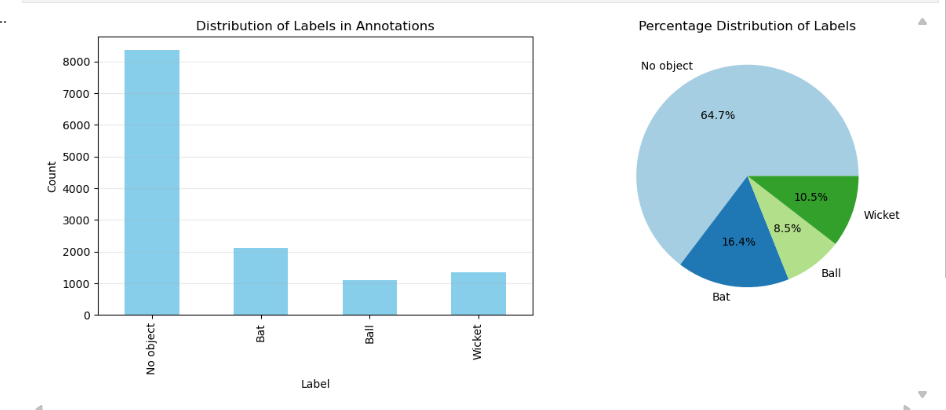
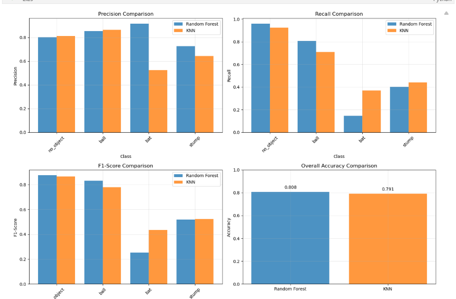

# Cricket Object Detection Project - Presentation

## Table of Contents
1. Project Overview
2. Folder Structure
3. Step-by-Step Workflow
4. Key Scripts and Pipelines
5. Model Training & Evaluation
6. Visualizations
7. Learnings & Challenges
8. References

---

## 1. Project Overview
- Goal: Detect and classify cricket objects (bat, ball, stumps, no_object) at the grid-cell level in images.
- Approach: Manual annotation, feature extraction, classical ML models (Random Forest, KNN), and visualization.

## 2. Folder Structure
```
cricket_object_detection/
├── data/                # Raw, train, test images, annotations
├── models/              # Saved models
├── outputs/             # CSVs, reports, visualizations
├── src/                 # Source code (preprocess, annotate, train, etc.)
├── requirements.txt     # Dependencies
├── README.md            # Project overview
└── TASKS.csv            # Task tracking
```

## 3. Step-by-Step Workflow
1. **Data Collection**: Gather and organize images by class.
2. **Preprocessing**: Resize/crop images to 800x600, save to train/test folders.
3. **Annotation**: Annotate each image with 8x8 grid cell labels (0: no_object, 1: ball, 2: bat, 3: stump).
4. **Manual Annotation**: Use GUI tool or script for interactive cell tagging.
    
5. **Feature Extraction**: Extract HOG, grayscale, and other features for each cell (see `src/cell_level_pipeline.py`).
6. **Save Features**: Store all cell features and labels in `outputs/cell_features.csv`.
7. **Model Training**: Train Random Forest and KNN classifiers on cell features.
8. **Evaluation**: Compare models using metrics (accuracy, precision, recall, F1) and visualizations.
9. **Prediction & Visualization**: Predict on new images, overlay grid and predicted labels, save results.

## 4. Key Scripts and Pipelines
- `src/preprocess.py`: Image resizing/cropping.
- `src/annotate.py`: Annotation utilities.
- `src/annotation_to_csv.py`: Convert annotations to CSV.
- `src/extract_features.py`: Feature extraction for each cell.
- `src/cell_level_pipeline.py`: Full pipeline (feature extraction, training, evaluation, visualization).

## 5. Model Training & Evaluation
- Trained both Random Forest and KNN classifiers on cell-level features.
- Compared models using classification reports and bar graphs for precision, recall, F1, and accuracy.

- Visualized predictions for multiple images per model.

## 6. Visualizations
- Overlaid predicted cell labels on images using colored rectangles (gray: no_object, red: ball, green: bat, blue: stump).
- Compared model predictions visually for 3 images per model.

## 7. Learnings & Challenges
- Importance of consistent annotation and preprocessing.
- Feature engineering (HOG, grayscale) is effective for classical ML.
- Aggregated features are useful for image-level tasks, but cell-level features are crucial for fine-grained classification.
- Model comparison (Random Forest vs. KNN) highlights trade-offs in accuracy and speed.
- Visualization is key for debugging and understanding model behavior.

## 8. References
- Project scripts and notebooks (`src/`, `notebooks/`)
- `latest_readme.md` for detailed workflow and team assignments
- scikit-learn, scikit-image documentation

---

*Prepared by: [Your Name]*
*Date: December 7, 2025*
